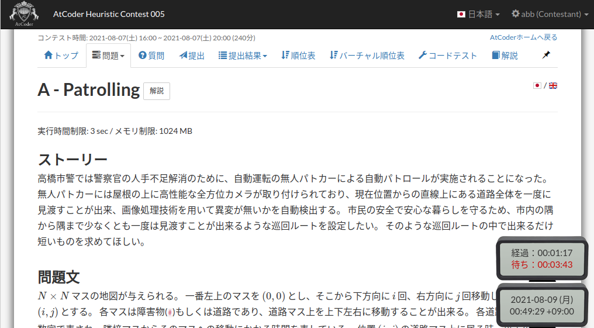

atcoder-wait-time-display
=====

## 概要

AtCoder 問題ページにおいて，前の提出からの経過時間および残り待ち時間を画面右下に表示します．

## 配布

- Greasy Fork: [atcoder\-wait\-time\-display](https://greasyfork.org/ja/scripts/430509-atcoder-wait-time-display)

## 更新履歴

- 2021.8.0
  - 初版
- 2021.8.1
  - PAST の提出間隔を取得できなかった問題を修正
- 2021.8.2
  - ゲノコン2021 対応

## 連絡先

- GitHub: [iilj \(iilj\)](https://github.com/iilj)
- Twitter: [siさん \(@iiljj\) / Twitter](https://twitter.com/iiljj)
